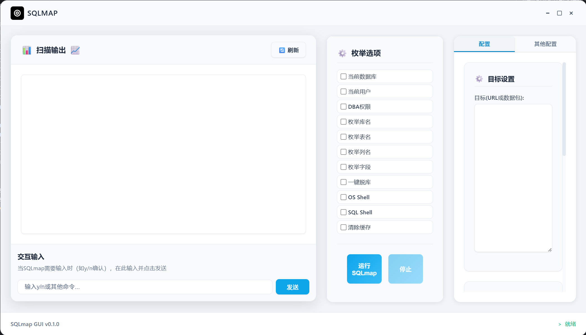
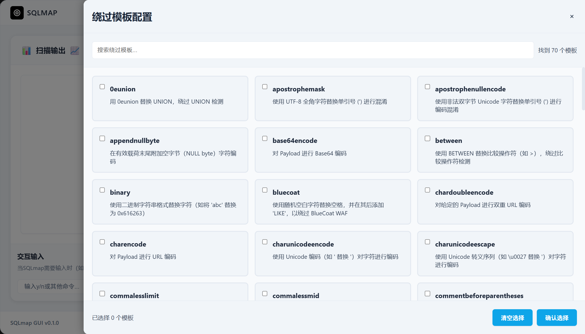

# SQLmap GUI

## 项目简介 / Project Introduction

SQLmap GUI是一个现代化的图形界面工具，封装了强大的开源SQL注入测试工具SQLmap。本工具旨在为安全研究人员和渗透测试工程师提供更直观、更易用的SQL注入测试体验，同时保留了SQLmap的全部核心功能。

SQLmap GUI is a modern graphical interface tool that wraps the powerful open-source SQL injection testing tool SQLmap. This tool aims to provide security researchers and penetration testers with a more intuitive and user-friendly SQL injection testing experience while preserving all the core functionalities of SQLmap.

## 功能特点 / Features

- **现代化界面**: 采用卡片式设计和流畅动画，提供优秀的用户体验
- **完整功能支持**: 支持SQLmap的所有主要功能和参数设置
- **实时输出**: 实时显示扫描和测试过程的详细输出
- **配置管理**: 支持保存和加载测试配置
- **内置SQLmap**: 集成了SQLmap工具，无需额外安装
- **Tamper脚本选择**: 方便地选择和管理SQLmap的绕过脚本

- **Modern Interface**: Card-based design with smooth animations for excellent user experience
- **Full Feature Support**: Supports all major SQLmap functionalities and parameter settings
- **Real-time Output**: Displays detailed output of scanning and testing processes in real-time
- **Configuration Management**: Save and load test configurations
- **Built-in SQLmap**: Integrated SQLmap tool, no additional installation required
- **Tamper Script Selection**: Easy selection and management of SQLmap bypass scripts

## 使用界面 / GUI

### 主界面 / Main Interface



### 配置界面 / Configuration Interface



## 技术栈 / Technology Stack

- **开发语言**: Rust
- **UI框架**: Dioxus (类似React的Rust UI框架)
- **核心工具**: SQLmap
- **构建系统**: Cargo
- **目标平台**: Windows桌面应用

- **Programming Language**: Rust
- **UI Framework**: Dioxus (React-like UI framework for Rust)
- **Core Tool**: SQLmap
- **Build System**: Cargo
- **Target Platform**: Windows Desktop Application

## 安装说明 / Installation Instructions

### 方法一：编译安装 / Method 1: Compile from Source

1. 确保安装了Rust和Cargo:
   ```bash
   curl --proto '=https' --tlsv1.2 -sSf https://sh.rustup.rs | sh
   ```

2. 克隆项目:
   ```bash
   git clone https://github.com/yourusername/sqlmap-GUI.git
   cd sqlmap-GUI
   ```

3. 编译并运行:
   ```bash
   cargo build --release
   cargo run --release
   ```

### 方法二：下载预编译版本 / Method 2: Download Pre-compiled Version

1. 从GitHub Releases页面下载最新的预编译版本
2. 解压后运行`sqlmap_gui.exe`

## 使用指南 / Usage Guide

1. **设置目标URL**: 在配置面板中输入要测试的目标URL
2. **配置测试参数**: 根据需要调整扫描级别、风险级别等参数
3. **选择测试功能**: 选择要执行的测试功能，如枚举数据库、转储数据等
4. **高级选项**: 设置自定义参数、选择tamper脚本
5. **执行测试**: 点击"Run SQLmap"按钮开始测试
6. **查看结果**: 在输出面板中实时查看测试结果和日志

1. **Set Target URL**: Enter the target URL to test in the configuration panel
2. **Configure Test Parameters**: Adjust scan level, risk level, and other parameters as needed
3. **Select Test Functions**: Choose test functions to execute, such as enumerating databases, dumping data, etc.
4. **Advanced Options**: Set custom parameters, select tamper scripts
5. **Execute Test**: Click the "Run SQLmap" button to start testing
6. **View Results**: View test results and logs in real-time in the output panel

## 注意事项 / Notes

- 本工具仅用于授权的安全测试和研究目的
- 请在使用前确保您有权限测试目标系统
- 作者不对工具的非法使用负责

- This tool is only for authorized security testing and research purposes
- Please ensure you have permission to test the target system before use
- The author is not responsible for illegal use of the tool

## 许可证 / License

本项目采用MIT许可证。详情请参阅LICENSE文件。

This project is licensed under the MIT License. See the LICENSE file for details.

## 贡献指南 / Contribution Guidelines

欢迎提交Issue和Pull Request来帮助改进这个项目。

Contributions are welcome! Please feel free to submit issues and pull requests to help improve this project.

## 致谢 / Acknowledgements

- SQLmap项目团队: 感谢他们开发了如此强大的SQL注入测试工具
- Dioxus框架开发者: 提供了优秀的Rust UI开发体验

- SQLmap Project Team: Thank you for developing such a powerful SQL injection testing tool
- Dioxus Framework Developers: For providing an excellent Rust UI development experience